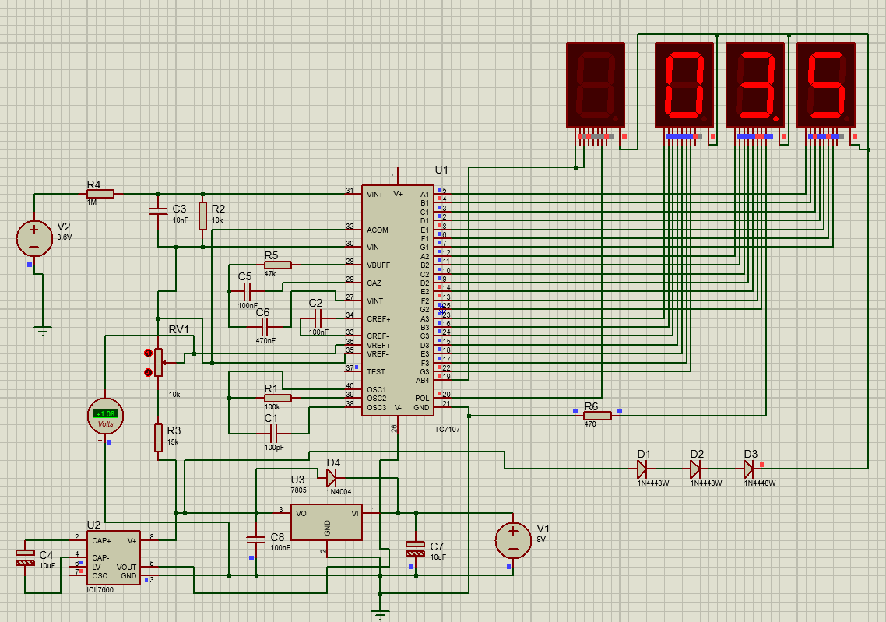

# Digital-Voltmeter
This is a digital voltmeter made with the ICL 7107 chip, here you can find the schematic in proteus, take into account that pin 1 should be connected to +5V, however in the simulation is fact is better without it.

The voltmeter is not exact, it has a 0.1V disparity

